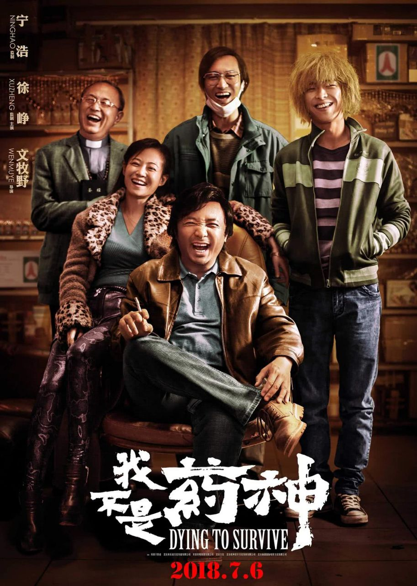
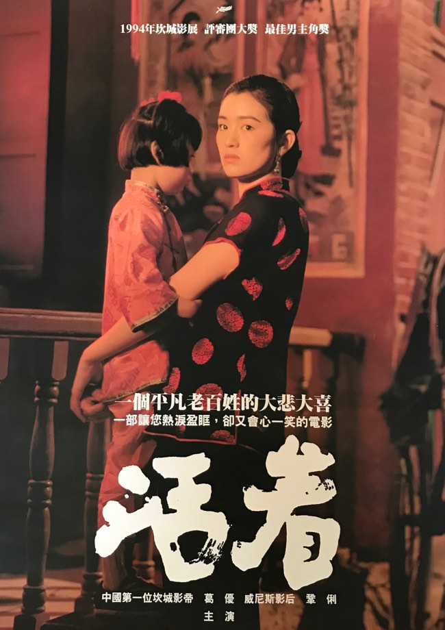
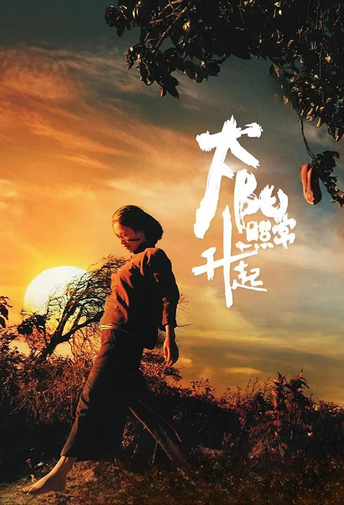
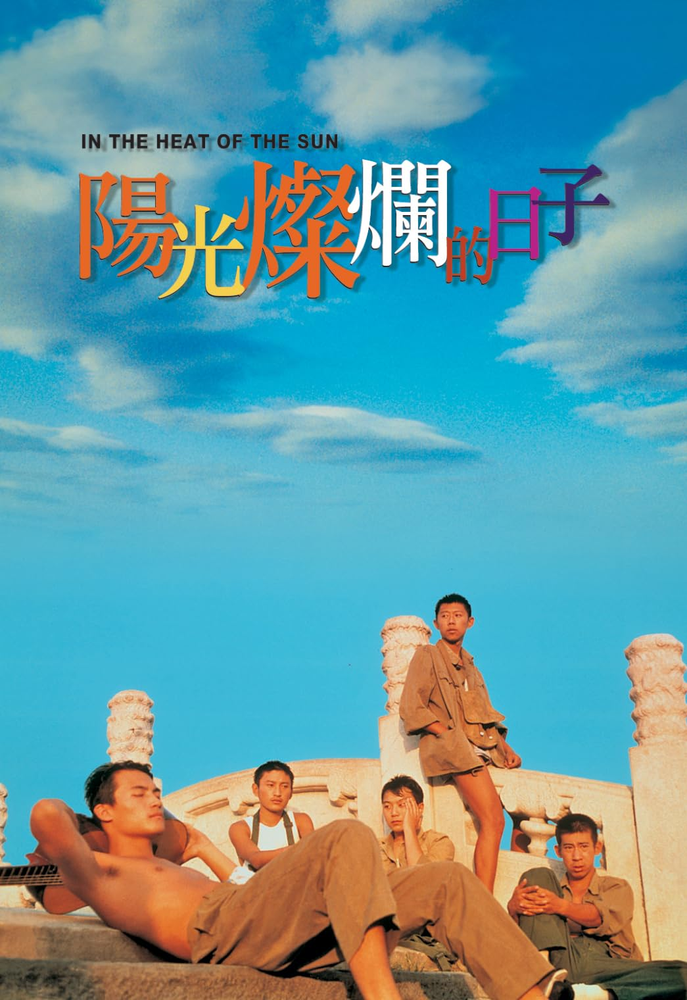
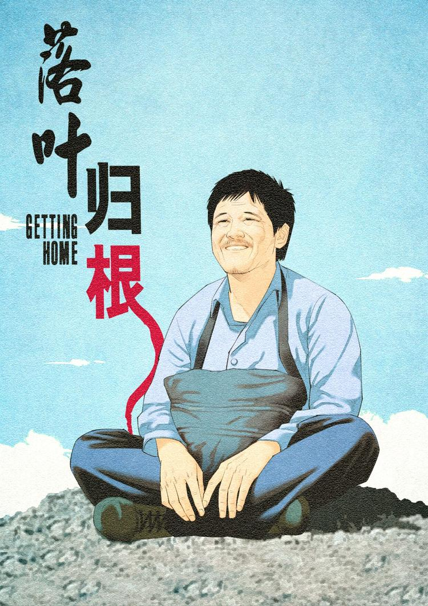
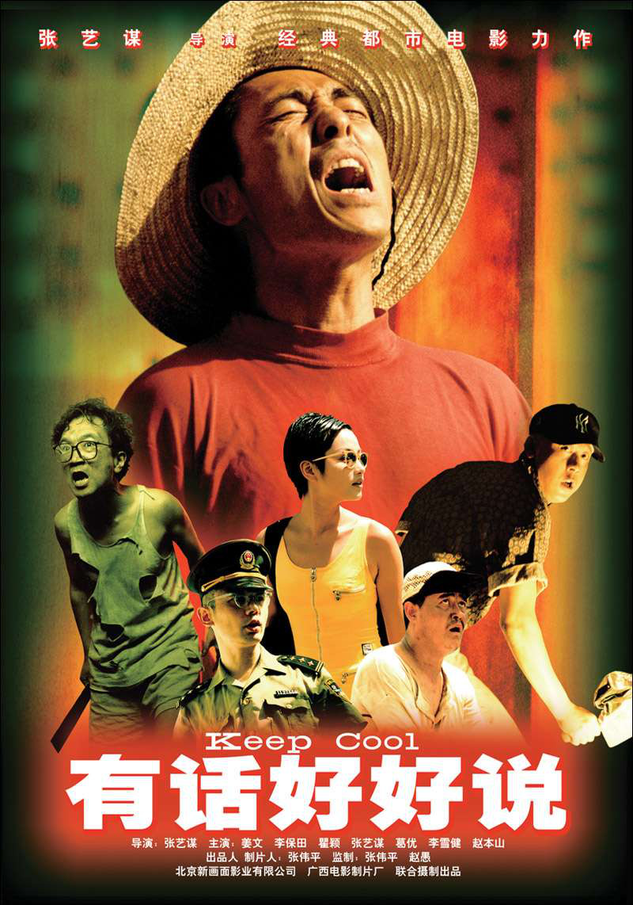

+++
date = '2026-07-15T10:00:00+01:00'
draft = false
title = 'Recomendaciones de Películas Nativas'
+++

Una pequeña colección de películas chinas formidables con las que estudiar el idioma. Todas joyas nativas con las que acercarse más a la cultura y sus infinitos matices. 

  

    
  

  

    

      

        <h3 class="song-title">我不是药神</h3>
        
<em>No soy el Dios de la medicina</em>

      

      
<strong>2018 - Wen Muye (文牧野)</strong>

    

    

      Años 2000
      Cotidiano
      Conmovedora
    

    
Basada la historia real de Lu Yong (陆勇), un paciente de leucemia chino que traficó con medicamentos genéricos y baratos contra el cáncer obtenidos en la India, ayudando a más de mil pacientes chinos afectados por la enfermedad y sus enormes costes económicos.

  

  

    
  

  

    

      

        <h3 class="song-title">活着</h3>
        
<em>¡Vivir!</em>

      

      
<strong>1994 - Zhang Yimou (张艺谋)</strong>

    

    

      Años 70
      Rural
      Atmosférica
    

    
Fugui, un hombre adinerado que lo pierde todo por el juego se ve arrastrado a la guerra civil china y, al regresar, acaba como campesino pobre. A través de su vida y la de su familia, la película muestra el paso de la China tradicional al régimen comunista y cómo estos cambios se mezclan con la dureza, el hambre y las pérdidas de la vida cotidiana.

  

  

    
  

  

    

      

        <h3 class="song-title">阳照常升起</h3>
        
<em>También sale el sol</em>

      

      
<strong>2007 - Jiangwen (姜文)</strong>

    

    

      Años 70
      Rural
      Atmosférica
    

    
Un poema ohnírico sobre varias historias entrelazadas: un hijo que lidia con su madre loca en un pueblo de Yunnan, dos amigos atraídos por la misma mujer en una universidad del este, y un cazador que abandonó su vida en el desierto del Gobi.

  

  

    
  

  

    

      

        <h3 class="song-title">阳光灿烂的日子</h3>
        
<em>Días de sol</em>

      

      
<strong>1994 - Jiangwen (姜文)</strong>

    

    

      Años 70
      Juvenil
      Nostálgica
    

    
Mientras adultos y padres (muchos de ellos oficiales del ejército) están ausentes o concentrados en la agitación política de la Revolución cultural de Pekín, un grupo de adolescentes queda libre de toda supervisión durante un verano interminable, marcado por una luz dorada y un calor sofocante.

  

  

    
  

  

    

      

        <h3 class="song-title">落叶归根</h3>
        
<em>Regreso a casa</em>

      

      
 <strong>2007 - Zhang Yang (张扬)</strong>

    

    

      Años 2000
      Rural
      Divertida
    

    
Un trabajador migrante se compromete a llevar a casa el cadáver de un compañero que ha muerto en un accidente, pero el viaje resulta mucho más complicado de lo esperado. Entre encuentros y personajes disparatados y todo tipo de contratiempos, hará lo imposible por cumplir su promesa y conseguir que su amigo vuelva a casa.</em>

  

  

    
  

  

    

      

        <h3 class="song-title">有话好好说</h3>
        
<em>Keep Cool</em>

      

      
<strong>1997 - Zhang Yimou (张艺谋)</strong>

    

    

      Años 90
      Coloquial
      Desternillante
    

    
Un vendedor ambulante se obsesiona con vengarse del escritor que dejó a su novia y publicó una novela basada en su historia. Su búsqueda de venganza se convierte en una sucesión de situaciones absurdas, discusiones y malentendidos, mientras el protagonista intenta recuperar el amor perdido y ajustar cuentas a su manera.

  

  

    
  

  

    

      

        <h3 class="song-title">让子弹飞</h3>
        
<em>Que vuelen las balas</em>

      

      
<strong>2010 - Jiangwen (姜文)</strong>

    

    

      Años 20
      Teatral
      Apoteósica
    

    
Un bandido se hace pasar por gobernador para quedarse con el dinero de un pueblo, pero allí se encuentra con un poderoso comerciante local dispuesto a desenmascararlo. Entre tiroteos, traiciones y engaños cada vez más frenéticos, ambos libran una partida de poder en la que nadie parece ser quien dice ser.

  

