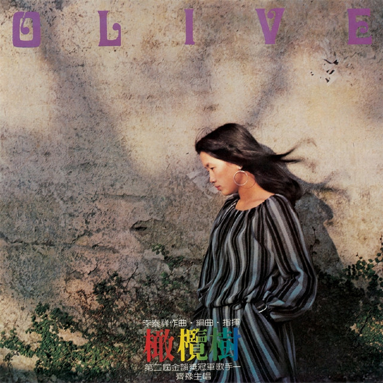

+++
date = '2026-07-15T10:00:00+01:00'
draft = false
title = 'Recomendaciones de Canciones Nativas'
+++

Una pequeña colección de canciones en chino que me parecen especialmente bonitas y útiles para estudiar. No es una lista de éxitos, sino canciones que destacan por su melodía, interpretación o significado.

  

    
  

  

    

      

        <h3 class="song-title">只要平凡</h3>
        
<em>Simplemente corriente</em>

      

      
<strong>张碧晨 (Zhang Bichen)</strong> &amp; <strong>张杰 (Zhang Jie)</strong>

    

    

      Actual
      
    

    
Tema principal de la película <em>Dying to Survive (我不是药神)</em>. Una canción emotiva sobre la vida cotidiana, el sufrimiento y la esperanza.

    

      <a href="https://open.spotify.com/intl-es/track/4wOmj4TdRpab8w4IGJiwJ8" target="_blank" rel="noopener noreferrer">Spotify</a>
      <!-- <a href="#">Letra</a> -->
    

  

  

     
  

  

    

      

        <h3 class="song-title">橄榄树</h3>
        
<em>El Olivo</em>

      

      
<strong>齐豫 (Chyi Yu)</strong>

    

    

      Poético
      
    

    
Un clásico de la música china moderna. Su letra transmite libertad, nostalgia y el deseo de viajar.

    

      <a href="https://open.spotify.com/intl-es/track/0y58OaDt2n4Z3e9TN7Lqne" target="_blank" rel="noopener noreferrer">Spotify</a>
      <!-- <a href="#">Letra</a> --> 
    

  

  

    
  

  

    

      

        <h3 class="song-title">镜中的你</h3>
        
<em>El tú del espejo</em>

      

      
<strong>翁倩玉 (Judy Ongg)</strong>

    

    

      Actual
      
    

    
Una balada suave al estilo de la música taiwanesa de los 70. El álbum entero tiene un estilo similar y canciones pegadizas, con un lenguaje cotidiano.

    

      <a href="https://open.spotify.com/intl-es/track/4m6TIJmC7uyEOyYTbn9BX9" target="_blank" rel="noopener noreferrer">Spotify</a>
      <!-- <a href="#">Letra</a> -->
    

  

  

    
  

  

    

      

        <h3 class="song-title">愿做菩萨那朵莲</h3>
        
<em>Deseo ser el loto del Bodisativa</em>

      

      
<strong>路勇 (Lu Yong)</strong>

    

    

      Budista
      
    

    
Versión recomendada de una canción budista con una atmósfera apasionada. El lenguaje usa fórmulas características del budismo mezclado con lenguaje más común.

    

      <a href="https://open.spotify.com/intl-es/track/2h1HVuBY57w7YslUK45qr8" target="_blank" rel="noopener noreferrer">Spotify</a>
      <!-- <a href="#">Letra</a> -->
    

  

  

    
  

  

    

      

        <h3 class="song-title">佳人曲</h3>
        
<em>Canción de la bella</em>

      

      
 <strong>苏曼 (Su Man)</strong>

    

    

      Clásico
      
    

    
Una interpretación moderna de un poema clásico. Algo críptica pero corta, con un aire muy evocador. Otra versión se convierte en una escena fundamental de la película <em>House of the flying daggers (十面埋伏).</em>

    

      <a href="https://open.spotify.com/intl-es/track/2cbufY6uqGOKxrRby9yma0" target="_blank" rel="noopener noreferrer">Spotify</a>
      <!-- <a href="#">Letra</a> -->
    

  

  

    
  

  

    

      

        <h3 class="song-title">冲动的惩罚</h3>
        
<em>Castigo por impulsividad</em>

      

      
<strong>刀郎 (Dao Lang)</strong>

    

    

      Actual
      
    

    
Una de las canciones más conocidas de Dao Lang, con un estilo muy característico. Larga y con un lenguaje cotidiano.

    

      <a href="https://open.spotify.com/intl-es/track/4gguQW55FKWghATBzcfLNX" target="_blank" rel="noopener noreferrer">Spotify</a>
      <!-- <a href="#">Letra</a> -->
    

  

  

    
  

  

    

      

        <h3 class="song-title">小苹果</h3>
        
<em>Manzanita</em>

      

      
<strong>筷子兄弟 (Chopstick Brothers)</strong>

    

    

      Actual
      
    

    
Probablemente la canción pop china más famosa de la década de 2010. Muy pegadiza y llena de energía. Aunque la melodía y videoclip la hagan parecer tonta, la letra tiene también frases muy bonitas.

    

      <a href="https://open.spotify.com/intl-es/track/0ZnxFHRtsl4MgBKuhXoqqe" target="_blank" rel="noopener noreferrer">Spotify</a>
      <!-- <a href="#">Letra</a> -->
    

  

